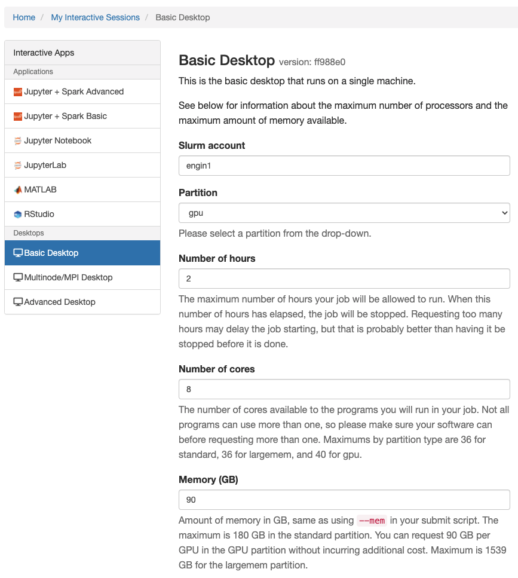

# Remote Desktop

Most likely, you won't need more than [JupyterLab](jupyterlab.md). But if you do need a full-on desktop (maybe for some heavy-duty software you need to run), it's super easy to spin one up. You can launch a single desktop, or even a cluster!

## How to launch it
Go to the [Great Lakes web interface](https://greatlakes.arc-ts.umich.edu/) and navigate to "My Interactive Sessions". You'll see something like below.



Use `Basic Desktop` to launch a single machine. Use `Multinode/MPI Desktop` to launch a cluster. If you want more options, you can use `Advanced Desktop`. All the configuration options are pretty self-explanatory. Simply scroll down to the bottom of the page and click the launch button.

## Remote Desktop on Native VNC Client (and without VPN)

Sometimes, you are off-campus and you dont want to connect to VPN, but you also want remote desktop. Follow these steps:

### Configure VNC (Only need to do this one time)
`TurboVNC`, which is a VNC server program, has been installed on Great Lakes. All we need to do is to modify `~/.vnc/xstartup.turbovnc`.

First, if `~/.vnc/xstartup.turbovnc` already exists, back it up by moving it:
```
mv ~/.vnc/xstartup.turbovnc ~/.vnc/xstartup.turbovnc.bak
```

If it does not exist, create it and set its permission:

```
cd ~
mkdir .vnc
cd .vnc
touch xstartup.turbovnc
chmod 700 xstartup.turbovnc
```
Then add the following lines to it (via `nano` or `vim`):
```
#!/bin/sh
unset SESSION_MANAGER
unset DBUS_SESSION_BUS_ADDRESS
exec startxfce4
```
This tells the VNC server to use `xfce` as its desktop (GUI) provider.


### Start VNC server on a compute node

Login to Great Lakes login node (via jump machine) and request a compute node that meets your needs:
```
ssh -J <uniqname>@login.itd.umich.edu <uniqname>@greatlakes.arc-ts.umich.edu
srun -p gpu --account chaijy0 --gres=gpu:1 --mem=20GB --cpus-per-task=4 --time 0-3:00 --pty bash
```

Then, you will enter the compute node. On the compute node, look up its hostname:
```
hostname
```
this will return something like this:
```
gl1021.arc-ts.umich.edu
```
Note this down.

Then on the compute node, spin up a VNC session by:
```
vncserver
```
This will return something like this:
```
...
...
...

WARNING: gl1021.arc-ts.umich.edu:30 is taken because of /tmp/.X30-lock
Remove this file if there is no X server gl1021.arc-ts.umich.edu:30

WARNING: gl1021.arc-ts.umich.edu:31 is taken because of /tmp/.X31-lock
Remove this file if there is no X server gl1021.arc-ts.umich.edu:31

Desktop 'TurboVNC: gl1021.arc-ts.umich.edu:35 (<uniqname>)' started on display gl1021.arc-ts.umich.edu:35

Starting applications specified in /home/<uniqname>/.vnc/xstartup.turbovnc
Log file is /home/<uniqname>/.vnc/gl1021.arc-ts.umich.edu:35.log

```
Note the `:35` above - it starts from `:35` because `:1` through `:34` have been taken. This means this new VNC session was started at `5935` port. VNC uses ports starting from `5901`. So `:1` will spawn at `5901`; `:2` will spawn at `5902` and so on.
Now the VNC server is up and running!

### Connect to VNC server on the compute node
First, we need to establish an SSH tunneling to forward the `5935` port to our own computer and then connect via localhost. To establish the SSH tunnel, on your laptop:
```
ssh -J <uniqname>@login.itd.umich.edu -N -f -L 59000:<gl1021.arc-ts.umich.edu>:<5935> <uniqname>@greatlakes.arc-ts.umich.edu
```
replace fields with `<>` to values obtained from above steps.

Then, on your laptop, open your favorite VNC client. For macOS users, the Finder already has a built-in VNC tool: `Go > Connect to Server`. (Btw, I recommend checkout `RealVNC` client for Mac users - it seems to be faster.)

To connect:
- Host: localhost
- Port: 59000

For macOS for example, enter `vnc://localhost:59000` and hit 'Connect'.

You will be asked to enter the password you set for VNC.

Then you should be entering the desktop (GUI).

