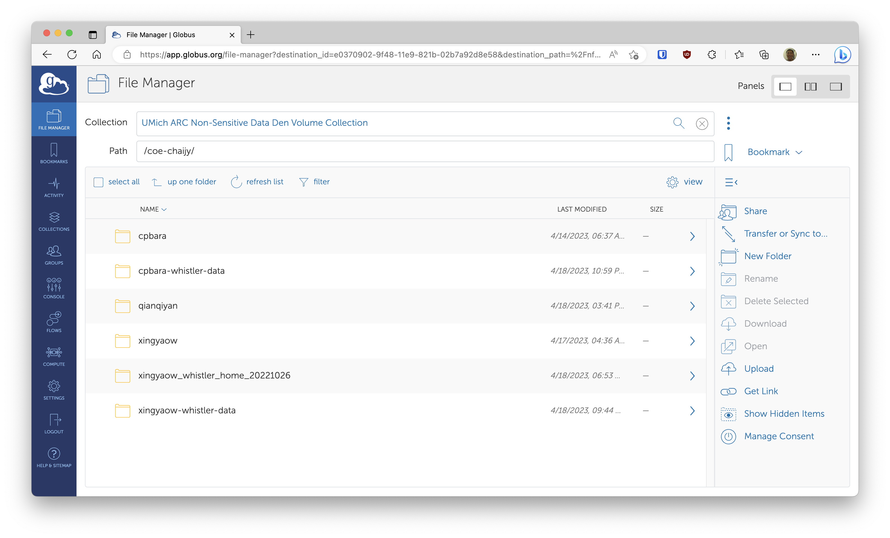
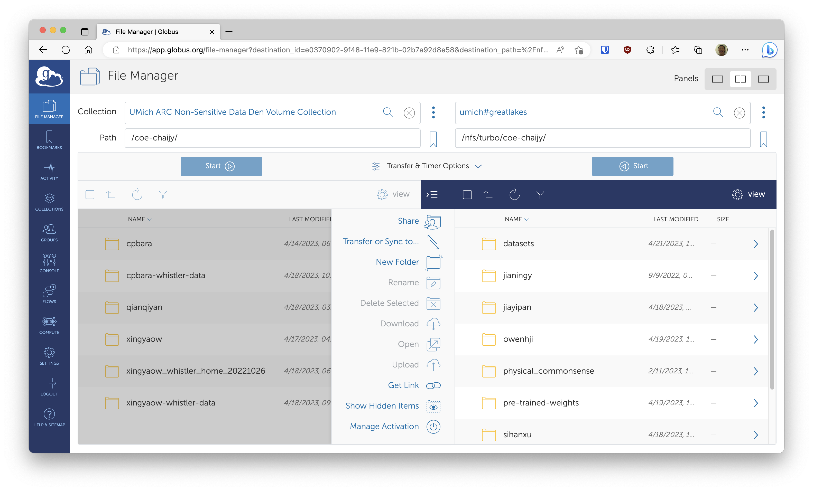
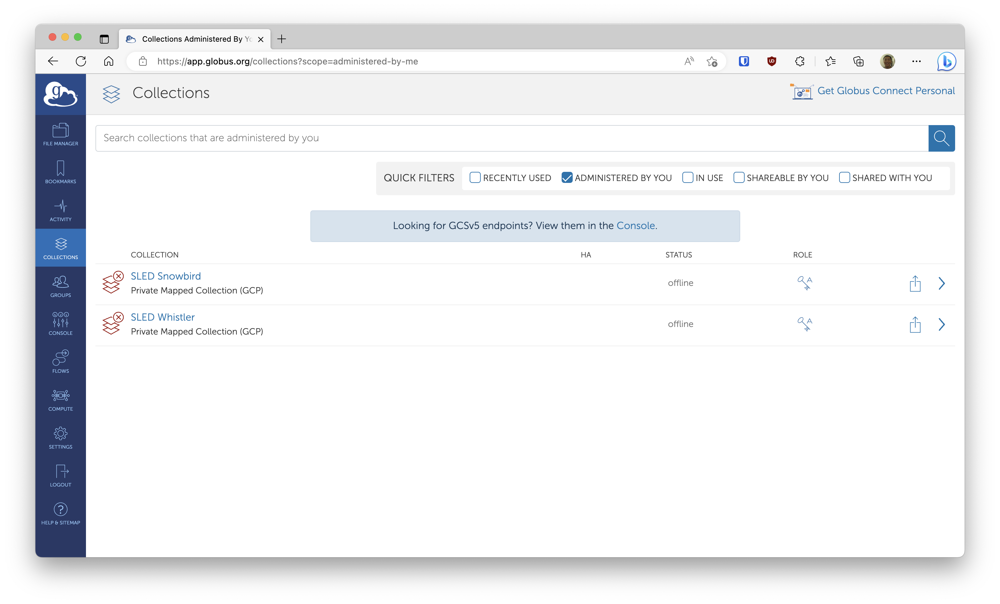

# Data Den

[Data Den](https://arc.umich.edu/data-den/) is a long-term archival storage system. You can't directly access it like a regular file system, and you need to use a system called [Globus](https://www.globus.org/) to transfer data. This means that Data Den is definitely not the choice for files you need ready access to. It's perfect for long-term archival purposes though; we get 100TB for free.

## Globus

Globus allows fast data transfer between servers that are running Globus. Once you're running Globus on your servers, you can simply use the web interface to transfer data. Simply go to https://www.globus.org/, and log in by searching for University of Michigan as your organization. Our Data Den server already has Globus running (managed by ARC), and the collection is "UMich ARC Non-Sensitive Data Den Volume Collection" and the path is `/coe-chaijy`.



### Great Lakes

Great Lakes nodes already have Globus running, so you can start transferring data on the web interface right away by selecting the double-panel UI. The collection for Great Lakes is "umich#greatlakes", and you can select any path reachable from Great Lakes. **Note that if you're archiving a large amount of data, you generally want to use [`archivetar`](#archivetar) that will compress and create tarballs of your data, then automatically upload it to Data Den.**



### Other Servers

Servers outside of Great Lakes, e.g., Whistler, don't have Globus running, but it is very easy to run it. Simply follow the instructions [here](https://www.globus.org/globus-connect-personal). When you first run it on your server, it'll ask you to log in via Globus. Once you do that and Globus is running on your server, you can see your server on the web interface as another collection.



## `archivetar`

`archivetar` is a handy tool that does a lot of the tedious tasks related to transferring data to Data Den. It does compression, tarball creation and data transfer for you. You can read more about it on this [doc](https://docs.google.com/document/d/1xkVPjkqge4BCgNMfNKJHCbBj2B-6t1_r0jJSi3nphwE/edit#heading=h.sir95sd0m8py) or its [git repo](https://github.com/brockpalen/archivetar).

### Great Lakes

Great Lakes already has `archivetar` as a module, so you simply need to call `module load archivetar` to start using it. Remember that Great Lakes also has Globus running, so you really don't need to do any other set up work to start transferring data to Data Den from Great Lakes. It's a good idea to run `archivetar` in a Slurm job, especially if you're backing up a lot of data. Here's an example Slurm script:

```bash
#!/bin/bash

### DO NOT USE GPU NODES!
#SBATCH --partition=standard
#SBATCH --time=02-00:00:00
#SBATCH --job-name=archivetar
#SBATCH --mail-user=<your-email@umich.edu>
#SBATCH --mail-type=BEGIN,END
### Totally fine to use chaijy0
#SBATCH --account=chaijy0
#SBATCH --nodes=1
#SBATCH --ntasks-per-node=1
#SBATCH --cpus-per-task=4
#SBATCH --mem-per-cpu=8GB
#SBATCH --output=%x-%j.log

module load archivetar
ARCHIVE_DIR=<path/to/dir/to/be/archived>
PREFIX=<descriptive-prefix-usually-dir-name>
DEST_DIR=/coe-chaijy/$PREFIX/
BUNDLE_DIR=<path/to/put/tarballs/using/scratch/recommended>
pushd $ARCHIVE_DIR
mkdir -p $BUNDLE_DIR

# --tar-size 100G: create a new tarball if over 100GB
# --lz4: compress using lz4
# --prefix: prefix for tarballs
# --destination-dir: destination directory on Data Den
# --bundle-dir: where to place the tarballs. /scratch recommended
# --save-list: save a list of files that have been archived. used later for purging them quickly.
archivetar --tar-size 100G --lz4 --prefix $PREFIX --destination-dir $DEST_DIR --bundle-dir $BUNDLE_DIR --save-list
```

Once your `archivetar` job is finished, you'd generally want to delete the files that have been backed up on Data Den. This can be a very time-consuming operation, but `archivetar` comes with another tool called `archivepurge` that makes purging extremely fast. Note that you must pass `--save-list` in your `archivetar` command in order to use `archivepurge`. Here is an example Slurm script:

```bash
#!/bin/bash

### DO NOT USE GPU NODES!
#SBATCH --partition=standard
#SBATCH --time=02-00:00:00
#SBATCH --job-name=archivepurge
#SBATCH --mail-user=<your-email@umich.edu>
#SBATCH --mail-type=BEGIN,END
### Totally fine to use chaijy0
#SBATCH --account=chaijy0
#SBATCH --nodes=1
#SBATCH --ntasks-per-node=1
#SBATCH --cpus-per-task=4
#SBATCH --mem-per-cpu=8GB
#SBATCH --output=%x-%j.log

module load archivetar
CACHE=<path/to/cache/file/created/by/archivetar.cache>
archivepurge --purge-list $CACHE
```

### Other Servers

The recommended way to run `archivetar` on servers outside of Great Lakes is to use the official Singularity container. The instructions can be found [here](https://github.com/brockpalen/archivetar/tree/master/singularity). Note that you need to specify `--source` and `--destination` as the UUIDs of the source and destination collections. You can find these UUIDs on the web interface by going to the collections pane. Note that you don't need to do this on Great Lakes, because they're configured to be "umich#greatlakes" and "UMich ARC Non-Sensitive Data Den Volume Collection" by default. Here's an example of running `archivetar` using a Singularity container, transferring data from my private Globus collection to our Data Den.

```bash
singularity exec path/to/archivetar_master.sif archivetar --tar-size 100G --lz4 --prefix $PREFIX --destination-dir /coe-chaijy/$PREFIX/ --source <uuid-for-your-private-collection> --destination ab65757f-00f5-4e5b-aa21-133187732a01 --bundle-dir /home/kpyu/archivetar/$PREFIX --save-list
```

`archivepurge` can be run in a similar way:

```bash
singularity exec path/to/archivetar_master.sif archivepurge --purge-list path/to/cache/file/created/by/archivetar.cache
```
