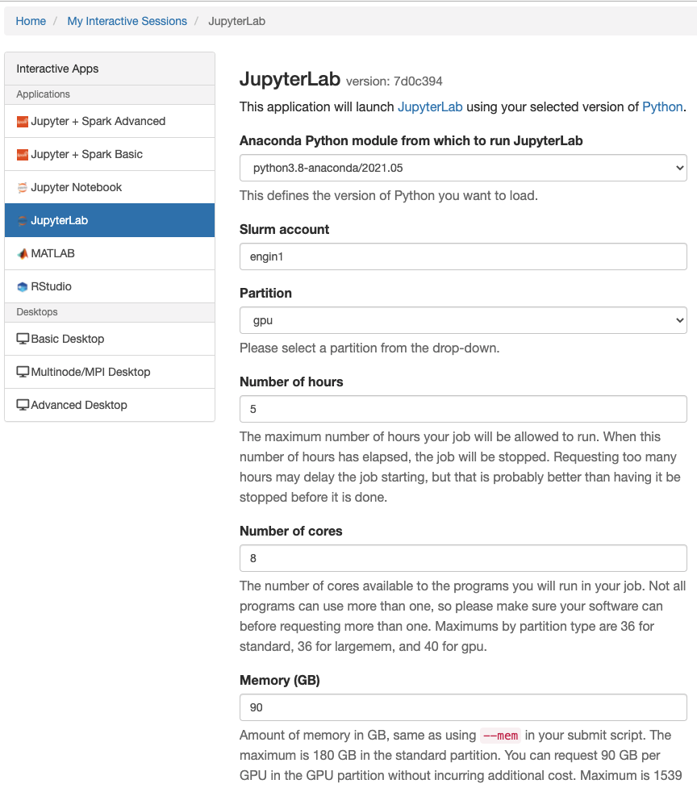

# JupyterLab

JupyterLab is a new web-based interactive development environment from Jupyter. It is a more feature complete IDE than the Jupyter Notebook that comes with the ability to use multiple terminals, file managers and Jupyter Notebooks. You can launch this with a click of a button, so it's usually the best place to start.

## How to launch it
Go to the [Great Lakes web interface](https://greatlakes.arc-ts.umich.edu/) and navigate to "My Interactive Sessions". You'll see something like below.

All the configuration options are pretty self-explanatory. Simply scroll down to the bottom of the page and click the launch button.
